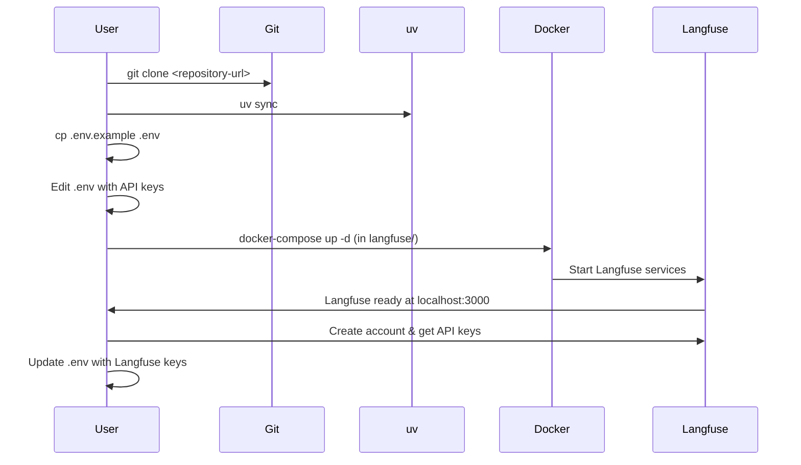

# AI Agent with Observability

[](https://python.org) [](https://opensource.org/licenses/MIT) [](https://langchain-ai.github.io/langgraph/) [](https://python.langchain.com/) [](https://www.crewai.com/)

A comprehensive AI agent implementation using **LangGraph, CrewAI, OpenRouter, and Langfuse** for intelligent conversations and observability.

[Quick Start](#setup) • [Features](#features) • [Installation](#installation) • [Usage](#usage) • [Documentation](#architecture)

</div>

## Features

- **LangGraph Chatbot**: Interactive conversational AI using LangGraph state management
- **CrewAI Agent**: Task-oriented AI agent for complex operations
- **OpenRouter Integration**: Access to multiple LLM providers through OpenRouter API
- **Langfuse Observability**: Full tracing and monitoring of AI interactions
- **Local Langfuse**: Self-hosted observability platform

### Key Capabilities

- Intelligent conversational AI with context awareness
- Persistent conversation states using LangGraph
- Multi-agent collaboration systems
- End-to-end observability and monitoring
- Easy integration with Docker and modern Python tooling
- High-performance AI processing

## Setup

### Prerequisites

- Python 3.12 or higher
- uv package manager
- Docker (for Langfuse)

### Installation

1. Clone the repository:

   ```bash
   git clone <repository-url>
   cd aiagent-with-observability
   ```
2. Install dependencies:

   ```bash
   uv sync
   ```
3. Set up environment variables:

   ```bash
   cp .env.example .env
   # Edit .env with your API keys
   ```
4. Install and start Langfuse locally:

   **Option 1: Using the included Langfuse setup**

   ```bash
   cd langfuse
   docker-compose up -d
   ```

   **Option 2: Full installation from scratch**

   a. Install Docker and Docker Compose on your system.

   b. Clone the Langfuse repository:

   ```bash
   git clone https://github.com/langfuse/langfuse.git
   cd langfuse
   ```

   c. Create environment file:

   ```bash
   cp .env.example .env
   # Edit .env with your configuration (database URLs, etc.)
   ```

   d. Start the services:

   ```bash
   docker-compose up -d
   ```

   e. Wait for services to be ready (check logs with `docker-compose logs`).

   f. Access Langfuse at http://localhost:3000

   g. Create an account and note down the API keys from the dashboard.

### Installation Sequence



**Expected Output:**

- `uv sync` should complete without errors, installing all dependencies
- Docker containers should start successfully
- Langfuse dashboard accessible at http://localhost:3000

## Usage

### Interactive Chatbot

Run the LangGraph-based chatbot:

```bash
uv run scripts/run_chatbot.py
```

**Expected Output:**

```bash
2024-01-01 12:00:00,000 - aiagent.core.chatbot - INFO - Starting AI agent chatbot
Chat with the AI agent! Type 'exit' or 'quit' to end.
You: Hello, how are you?
2024-01-01 12:00:01,000 - aiagent.core.chatbot - INFO - Processing user message: Hello, how are you?...
AI: Hello! I'm doing well, thank you for asking. How can I help you today?
You: exit
2024-01-01 12:00:02,000 - aiagent.core.chatbot - INFO - User ended the chat session
Goodbye!
```

This starts an interactive chat session where you can converse with the AI agent. All interactions are traced in Langfuse.

### Task-Oriented Agent

Run the CrewAI-based agent:

```bash
uv run scripts/run_agent.py
```

**Expected Output:**

```bash
LiteLLM completion() model= z-ai/glm-4.5-air:free; provider = openrouter
14:46:20 - LiteLLM:INFO: utils.py:1308 - Wrapper: Completed Call, calling success_handler
2025-12-04 14:46:20,021 - LiteLLM - INFO - Wrapper: Completed Call, calling success_handler
Agent Result: Langfuse is like a special dashboard or notebook that helps developers keep track of their AI applications. When developers build applications that use AI (like chatbots, content generators, or recommendation systems), Langfuse helps them see what's happening "under the hood."

Think of it like a flight recorder for airplanes - it records everything that happens when the AI is working:
- What questions users are asking
- What information the AI is looking at
- What decisions the AI is making
- What answers the AI is giving back

This helps developers when something goes wrong. If an AI gives a strange or incorrect answer, developers can look at Langfuse to see exactly what happened and fix the problem. It's also useful for improving the AI over time by seeing what kinds of questions it handles well and where it struggles.

Langfuse is particularly helpful for teams building complex AI systems because it provides a centralized place to monitor and understand how their AI is performing across many different situations.
2025-12-04 14:46:20,038 - aiagent.core.agent - INFO - Task completed successfully
Task: ╭───────────────────────────────────────────────────────────── Trace Batch Finalization ─────────────────────────────────────────────────────────────╮
│ ✅ Trace batch finalized with session ID: a2ce2f20-70dd-4300-a6c1-c3fb97bf6413                                                                     │
│                                                                                                                                                    │
│ 🔗 View here: https://app.crewai.com/crewai_plus/ephemeral_trace_batches/a2ce2f20-70dd-4300-a6c1-c3fb97bf6413?access_code=TRACE-9e144713e1         │
│ 🔑 Access Code: TRACE-9e144713e1                                                                                                                   │
```

*See [assets/agent_output_example.txt](assets/agent_output_example.txt) for the complete output.*

This executes a predefined task using the CrewAI framework with full observability enabled. The agent automatically synchronizes with CrewAI Plus for trace batch management, providing detailed execution insights and performance monitoring.

## Configuration

### Environment Variables

|        Variable        |      Description      |            Required            |
| :---------------------: | :--------------------: | :-----------------------------: |
| `LANGFUSE_SECRET_KEY` |  Langfuse secret key  |               Yes               |
| `LANGFUSE_PUBLIC_KEY` |  Langfuse public key  |               Yes               |
|  `LANGFUSE_BASE_URL`  |  Langfuse server URL  | No (defaults to localhost:3000) |
| `OPENROUTER_API_KEY` |   OpenRouter API key   |               Yes               |
|    `YOUR_SITE_URL`    | Site URL for rankings |            Optional            |
|   `YOUR_SITE_NAME`   | Site name for rankings |            Optional            |

### CrewAI Plus Integration

The agent integrates with **CrewAI Plus** for enhanced observability and trace management. When running agents, you'll see trace batch finalization with session IDs and access codes.

**Features:**
- **Trace Batch Management**: Automatic session tracking and finalization
- **Access Codes**: Secure links to view detailed execution traces
- **Multi-Agent Coordination**: Synchronized agent collaboration with full observability

**Trace Access:**
- Use the provided access code to view detailed execution traces
- Traces include agent interactions, decision-making processes, and performance metrics
- Access via: `https://app.crewai.com/crewai_plus/ephemeral_trace_batches/{session_id}?access_code={code}`

### Langfuse Dashboard

Access the Langfuse dashboard at http://localhost:3000 to view traces, metrics, and analytics of your AI agent interactions.

## Architecture


### Components

- **Scripts**: Entry points for running chatbot and agent
- **Core Modules**: Main business logic for AI interactions
- **Configuration**: Settings management via Pydantic
- **External Services**: OpenRouter for LLMs, Langfuse for observability
- **Data Flow**: User input → Processing → LLM → Response → Tracing

## Development

### Code Structure

```
aiagent-with-observability/
├── aiagent/
│   ├── __init__.py
│   ├── core/
│   │   ├── __init__.py
│   │   ├── chatbot.py          # LangGraph chatbot implementation
│   │   └── agent.py            # CrewAI agent implementation
│   └── config/
│       ├── __init__.py
│       └── settings.py         # Configuration management
├── scripts/
│   ├── run_chatbot.py          # Chatbot runner script
│   └── run_agent.py            # Agent runner script
├── tests/                      # Test directory
├── docs/                       # Documentation
├── .env                        # Environment configuration
├── .gitignore                  # Git ignore rules
├── pyproject.toml              # Project dependencies
├── README.md                   # This file
└── main.py                     # Legacy CrewAI implementation
```

### Adding New Features

1. Implement new agent logic in respective files
2. Ensure proper error handling and logging
3. Update environment variables as needed
4. Test with Langfuse tracing enabled

## Contributing

1. Follow the existing code style and structure
2. Add comprehensive docstrings
3. Ensure all interactions are properly traced
4. Test thoroughly with different scenarios

## License

MIT License - See LICENSE file for details.
